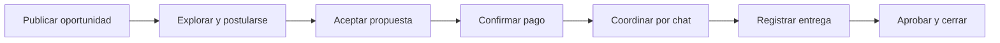
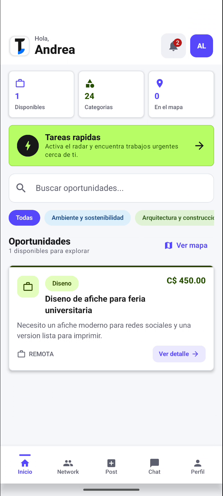
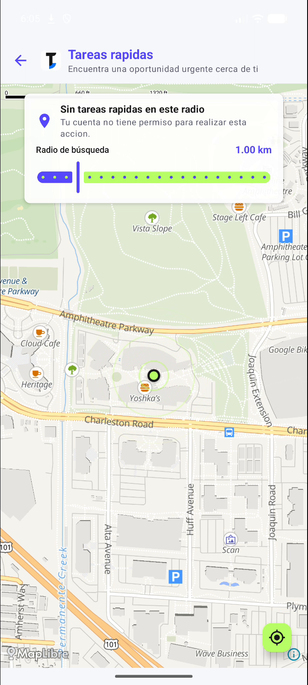
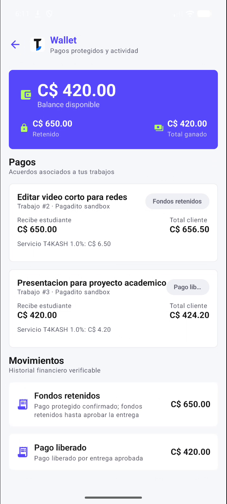
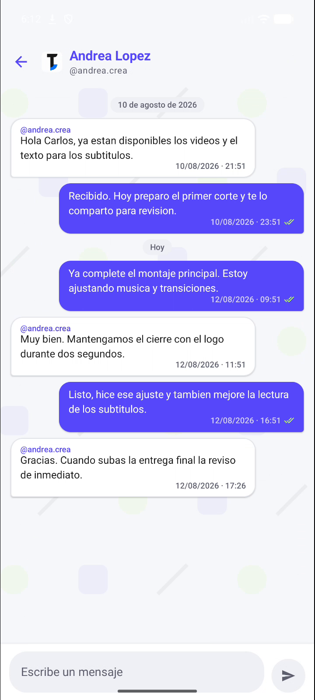
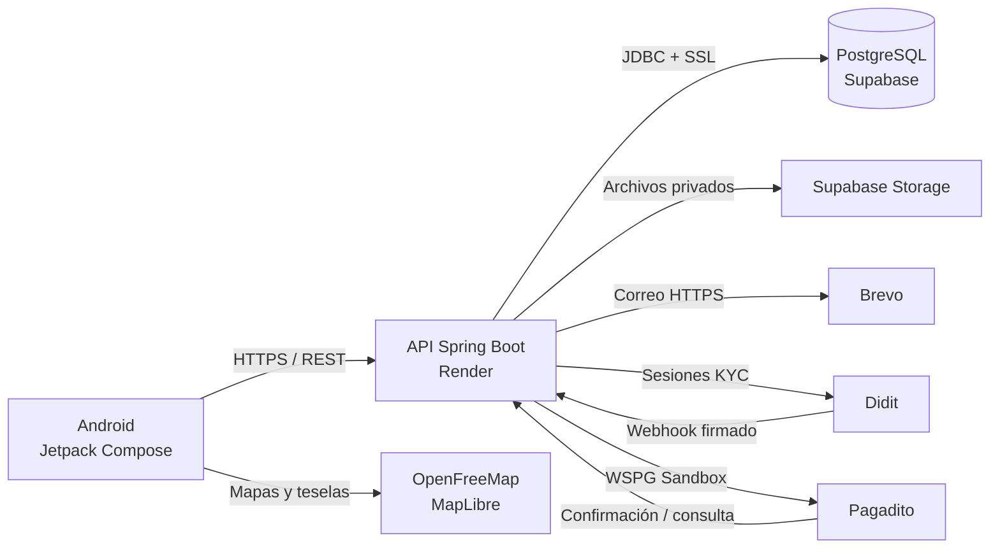
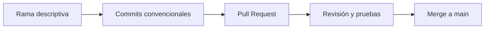

<div align="center">
  
  <h1>T4KASH</h1>
  <p><strong>Oportunidades, talento y experiencia para la comunidad universitaria.</strong></p>
  <p>
    <a href="./mobile"></a>
    <a href="./backend"></a>
    <a href="./database"></a>
    <a href="#control-de-versiones"></a>
  </p>
  <p>
    <a href="https://t4k4sh.onrender.com/api/health">API</a> ·
    <a href="https://t4k4sh.onrender.com/swagger-ui/index.html">Swagger</a> ·
    <a href="https://www.figma.com/design/k5PeSZUFQJgIja3Mw2BpAw/Sin-t%C3%ADtulo?node-id=0-1">Figma</a>
  </p>
</div>

T4KASH es una aplicación móvil que conecta estudiantes con personas, empresas e
instituciones que publican microtrabajos, tutorías, proyectos y oportunidades flexibles.
El MVP reúne marketplace, red universitaria, seguimiento de trabajos, comunicación y
pagos de prueba en un flujo trazable.

> **Entorno de demostración:** la API se ejecuta en Render, PostgreSQL y los archivos
> se administran en Supabase, y Android consume el backend mediante HTTPS.

## Contenido

- [Producto](#producto)
- [Funciones principales](#funciones-principales)
- [Capturas](#capturas)
- [Arquitectura](#arquitectura)
- [Tecnologías](#tecnologías)
- [Estructura](#estructura-del-repositorio)
- [Instalación](#instalación-y-ejecución)
- [Uso de la API](#uso-de-la-api)
- [Seguridad](#seguridad)
- [Pruebas](#pruebas)
- [Despliegue](#despliegue)
- [Base de datos y diagramas](#base-de-datos-y-diagramas)
- [Control de versiones](#control-de-versiones)

## Producto

Los estudiantes necesitan obtener ingresos y experiencia sin abandonar sus horarios
académicos. Al mismo tiempo, muchas personas requieren ayuda puntual, pero los canales
informales dificultan verificar perfiles, organizar postulaciones, controlar entregas y
dar seguimiento a los pagos.

T4KASH organiza ese proceso:



### Estado del MVP

| Área | Estado de demostración |
|---|---|
| Marketplace, tareas rápidas y mapa | Operativo |
| Registro, correo, segundo paso y recuperación | Operativo |
| Postulaciones, trabajos, entregas y chat | Operativo |
| Wallet y Pagadito | Integrado en Sandbox |
| Archivos privados | Integrado con Supabase Storage |
| Network universitario | Operativo |
| Moderación, reportes y administración | Operativo |
| Calificaciones y reputación | Operativo |
| KYC de identidad | Integrado con Didit Hosted Sessions |
| Notificaciones push FCM | En integración en rama separada |

## Funciones principales

### Marketplace

- Publicación y edición de oportunidades remotas, presenciales e híbridas.
- Categorías, habilidades, presupuesto y fechas de postulación y entrega.
- Postulaciones con propuesta económica y aceptación por el propietario.
- Límite de trabajos activos y control de estados.
- Entregas, comentarios, correcciones y aprobación.
- Archivos adjuntos privados de hasta 10 MB desde Android.

### Tareas rápidas

- Búsqueda por ubicación y radio configurable.
- Vigencia automática de 24 horas.
- Asignación inmediata para oportunidades urgentes cercanas.
- Presupuesto máximo de C$1,000 y confirmación de efectivo por ambas partes.

### Identidad y perfiles

- Registro con correo personal o institucional.
- Detección automática de universidad por dominio.
- Selección de carrera para dominios universitarios reconocidos.
- Verificación de correo, segundo paso de acceso y recuperación de contraseña.
- Nombre de usuario público único y perfil consultable por arroba.
- Verificación estudiantil administrativa y KYC alojado mediante Didit.

### Comunicación y comunidad

- Conversaciones vinculadas a los participantes de un trabajo.
- Mensajes, estados de lectura y notificaciones internas.
- Feed universitario con publicaciones, comentarios, reacciones y guardados.
- Reportes y herramientas administrativas de moderación.

### Finanzas de demostración

- Wallet calculada desde movimientos verificables.
- Checkout y consulta de pagos mediante Pagadito Sandbox.
- Fondos retenidos, liberación, reembolso y disputas auditables.
- Efectivo únicamente para tareas presenciales y tareas rápidas.
- Tarifa de servicio visible antes de confirmar el pago.

## Capturas

<div align="center">
  <table>
    <tr>
      <td align="center"><strong>Marketplace</strong></td>
      <td align="center"><strong>Tareas rápidas</strong></td>
      <td align="center"><strong>Wallet Sandbox</strong></td>
      <td align="center"><strong>Chat</strong></td>
    </tr>
    <tr>
      <td></td>
      <td></td>
      <td></td>
      <td></td>
    </tr>
  </table>
</div>

## Arquitectura



- Android nunca se conecta directamente a PostgreSQL ni recibe claves privadas.
- Spring Boot concentra autenticación, reglas de negocio, autorización y persistencia.
- Supabase administra PostgreSQL y el bucket privado de archivos.
- Brevo envía códigos de activación, acceso y recuperación mediante HTTPS.
- Didit procesa documento, prueba de vida y coincidencia facial; T4KASH conserva estados
  y una huella irreversible del documento.
- Pagadito funciona exclusivamente en Sandbox durante la demostración.

## Tecnologías

| Capa | Tecnologías |
|---|---|
| Android | Kotlin, Jetpack Compose, Navigation Compose |
| Red móvil | Retrofit, OkHttp, Gson |
| Mapas | MapLibre Compose, OpenFreeMap |
| Backend | Java 21, Spring Boot, Spring Data JPA |
| API | REST, Bean Validation, Swagger / OpenAPI |
| Datos | PostgreSQL, Supabase, Supabase Storage |
| Integraciones | Brevo, Didit, Pagadito Sandbox |
| Desarrollo local | Docker Compose, Maven, Gradle |
| Despliegue | Render y Supabase |

Las versiones exactas se administran en
[`backend/pom.xml`](./backend/pom.xml) y
[`mobile/gradle/libs.versions.toml`](./mobile/gradle/libs.versions.toml).

## Estructura del repositorio

```text
T4k4sh/
├── backend/
│   ├── src/main/              API organizada por módulos
│   ├── src/test/              Pruebas unitarias e integrales
│   ├── Dockerfile             Imagen de la API
│   ├── docker-compose.yml     API y PostgreSQL local
│   └── pom.xml                Dependencias Maven
├── mobile/
│   ├── app/src/main/          Aplicación Android
│   └── gradle/                Catálogo de dependencias
├── database/
│   ├── schema-postgresql.sql  Esquema oficial
│   └── sqlserver-original.sql Referencia histórica
├── docs/
│   ├── capturas/              Evidencia visual actual
│   └── diagramas/             ERD y UML
├── render.yaml                Configuración de Render
└── README.md
```

El backend sigue una estructura modular por dominio: `identity`, `marketplace`,
`communication`, `finance`, `network`, `moderation` y `admin`. Cada módulo separa
controladores, servicios, repositorios, entidades y objetos de transferencia.

## Instalación y ejecución

### Requisitos

- Git.
- JDK 21.
- Docker Desktop con Docker Compose.
- Android Studio y un emulador o teléfono Android.
- Conexión a Internet para el entorno de demostración.

### Backend y PostgreSQL local

```powershell
git clone https://github.com/Renesls/T4k4sh.git
cd T4k4sh\backend
docker compose up -d --build
```

| Servicio | Dirección local |
|---|---|
| API | `http://localhost:8080/api/` |
| Swagger | `http://localhost:8080/swagger-ui/index.html` |
| Health | `http://localhost:8080/api/health` |

```powershell
docker compose logs -f api
docker compose down
```

La primera creación del volumen carga automáticamente
[`database/schema-postgresql.sql`](./database/schema-postgresql.sql).

### Android contra Render

```powershell
cd mobile
.\gradlew.bat :app:assembleDebug
```

APK generado:

```text
mobile/app/build/outputs/apk/debug/app-debug.apk
```

### Android contra el backend local

```powershell
.\gradlew.bat :app:assembleDebug `
  -PT4KASH_API_BASE_URL=http://10.0.2.2:8080/api/
```

`10.0.2.2` representa la computadora anfitriona desde el emulador de Android.

<details>
<summary><strong>Variables de entorno</strong></summary>

Las referencias completas y valores de ejemplo están en
[`backend/.env.example`](./backend/.env.example). Ningún secreto debe guardarse en Git.

| Grupo | Variables principales |
|---|---|
| PostgreSQL | `SPRING_DATASOURCE_URL`, `SPRING_DATASOURCE_USERNAME`, `SPRING_DATASOURCE_PASSWORD` |
| API | `SERVER_PORT`, `APP_PUBLIC_BASE_URL`, `APP_CORS_ALLOWED_ORIGINS` |
| Supabase Storage | `SUPABASE_URL`, `SUPABASE_SECRET_KEY`, `SUPABASE_STORAGE_BUCKET` |
| Correo | `APP_MAIL_ENABLED`, `APP_MAIL_PROVIDER`, `APP_MAIL_FROM`, `BREVO_API_KEY` |
| Didit | `APP_DIDIT_ENABLED`, `DIDIT_API_KEY`, `DIDIT_WORKFLOW_ID`, `DIDIT_WEBHOOK_SECRET`, `DIDIT_DOCUMENT_HASH_SECRET` |
| Pagadito | `APP_PAGADITO_ENABLED`, `APP_PAGADITO_ENVIRONMENT`, `PAGADITO_UID`, `PAGADITO_WSK` |
| Administración | `APP_AUTH_EVALUATOR_EMAILS`, `APP_AUTH_ADMIN_EMAILS` |
| Android | `T4KASH_API_BASE_URL` |

Render administra las variables del backend. Android recibe únicamente la URL pública de
la API.

</details>

## Uso de la API

La documentación interactiva contiene todos los contratos:

- **Swagger publicado:** https://t4k4sh.onrender.com/swagger-ui/index.html
- **Health check:** https://t4k4sh.onrender.com/api/health
- **Base URL:** `https://t4k4sh.onrender.com/api/`

### Autenticación en dos pasos

1. `POST /api/auth/login` valida correo y contraseña y envía un código temporal.
2. `POST /api/auth/login/verify` confirma el código y entrega la sesión.
3. Los endpoints privados utilizan `Authorization: Bearer <token>`.

```json
{
  "correo": "estudiante@universidad.edu.ni",
  "password": "contraseña-segura"
}
```

```json
{
  "correo": "estudiante@universidad.edu.ni",
  "codigo": "123456"
}
```

### Crear una oportunidad

```http
POST /api/tasks
Authorization: Bearer <token>
Content-Type: application/json
```

```json
{
  "idCategoria": 1,
  "titulo": "Diseñar afiche para actividad universitaria",
  "descripcion": "Crear una propuesta lista para redes sociales.",
  "presupuesto": 500,
  "tipoOportunidad": "TAREA",
  "modalidad": "REMOTA",
  "fechaLimitePostulacion": "2026-09-02T18:00:00",
  "fechaLimite": "2026-09-05T18:00:00"
}
```

<details>
<summary><strong>Grupos de endpoints implementados</strong></summary>

| Grupo | Prefijos principales |
|---|---|
| Autenticación | `/api/auth`, `/api/identity` |
| Perfiles y verificaciones | `/api/profiles`, `/api/student-verifications`, `/api/identity-verifications` |
| Marketplace | `/api/tasks`, `/api/quick-tasks`, `/api/applications`, `/api/jobs`, `/api/deliveries` |
| Comunicación | `/api/conversations`, `/api/notifications` |
| Network | `/api/network` |
| Finanzas | `/api/wallet`, `/api/payments`, `/api/disputes` |
| Archivos | `/api/attachments`, adjuntos de tareas y entregas |
| Moderación | `/api/reports`, `/api/admin` |

Swagger muestra método, cuerpo, respuesta, validaciones y autorización de cada operación.

</details>

## Seguridad

| Control | Aplicación |
|---|---|
| Contraseñas | Hash BCrypt; nunca se almacena la contraseña original |
| Sesiones | Token aleatorio; PostgreSQL conserva solamente su hash SHA-256 |
| Segundo paso | Código temporal enviado por correo después de validar credenciales |
| Autorización | Roles, propiedad del recurso y participación en el trabajo |
| Entradas | Bean Validation, restricciones PostgreSQL y errores uniformes |
| Archivos | Bucket privado, validación de tipo/tamaño y descarga mediante la API |
| Webhooks | Firma, ventana temporal e idempotencia para Didit y pagos |
| KYC | Datos biométricos procesados por Didit; T4KASH conserva referencias mínimas |
| Base de datos | RLS bloquea el acceso con claves públicas de Supabase |
| Secretos | Variables privadas de Render; nunca se incluyen en Android ni Git |

La aplicación toma el usuario desde la sesión autenticada. Android no puede declarar por
su cuenta quién es propietario, estudiante, cliente o administrador de una operación.

## Pruebas

### Backend

```powershell
cd backend
.\mvnw.cmd test
```

Las pruebas cubren identidad, seguridad, marketplace, entregas, finanzas, archivos,
moderación, comunicación y Network. Las pruebas PostgreSQL utilizan Testcontainers cuando
Docker está disponible.

### Android

```powershell
cd mobile
.\gradlew.bat :app:testDebugUnitTest
.\gradlew.bat :app:lintDebug
.\gradlew.bat :app:assembleDebug
```

Se validan formatos, fechas, moneda, distancias, dominios institucionales, manejo del
teclado y compilación del APK.

## Despliegue

| Componente | Servicio |
|---|---|
| API Docker | Render Web Service |
| PostgreSQL | Supabase Database |
| Archivos | Supabase Storage |
| Correo | Brevo Email API |
| KYC | Didit Hosted Sessions |
| Pagos | Pagadito Sandbox |
| Mapas | OpenFreeMap / MapLibre |

Flujo de publicación:

1. Aplicar de forma controlada el cambio requerido en Supabase.
2. Subir el código mediante Pull Request.
3. Render construye el `Dockerfile` y despliega la API.
4. Verificar `/api/health` y Swagger.
5. Compilar Android apuntando a la URL de Render.
6. Ejecutar una prueba funcional desde el emulador o teléfono.

El plan gratuito de Render puede suspender la instancia por inactividad; la primera
solicitud puede tardar mientras el servicio vuelve a iniciar.

## Base de datos y diagramas

La fuente oficial es
[`database/schema-postgresql.sql`](./database/schema-postgresql.sql). El modelo contiene
54 tablas normalizadas y organizadas en identidad, marketplace, finanzas, puntos,
comunicación, Network, moderación y auditoría.

Incluye:

- Llaves primarias y foráneas.
- Restricciones de dominio, unicidad y consistencia.
- Índices compuestos para consultas frecuentes.
- Catálogos iniciales de roles, universidades, carreras, categorías y habilidades.
- Idempotencia y trazabilidad para pagos y webhooks.
- Row Level Security para impedir acceso directo desde claves públicas.

Los diagramas ERD, clases, actividades y casos de uso se encuentran en
[`docs/diagramas`](./docs/diagramas).

> El esquema contiene instrucciones `DROP TABLE` para recrear entornos de desarrollo.
> Sobre una base con información deben aplicarse cambios específicos desde SQL Editor.

## Control de versiones

El equipo trabaja con ramas, Pull Requests y Conventional Commits. Cada rama debe expresar
su propósito, no solamente el nombre de quien trabaja en ella.

```text
feat/marketplace-tareas-rapidas
feat/firebase-notificaciones
fix/didit-webhook
docs/readme-final
```

Ejemplos de commits:

```text
feat: agregar búsqueda de tareas rápidas por radio
fix: validar la firma del webhook de identidad
docs: mejorar arquitectura y guía de ejecución
test: cubrir aceptación y entrega de trabajos
chore: ajustar variables del despliegue
```

Flujo aplicado:



## Equipo

Proyecto desarrollado por **Thinking Out Loud** para el Hackathon 2026.
